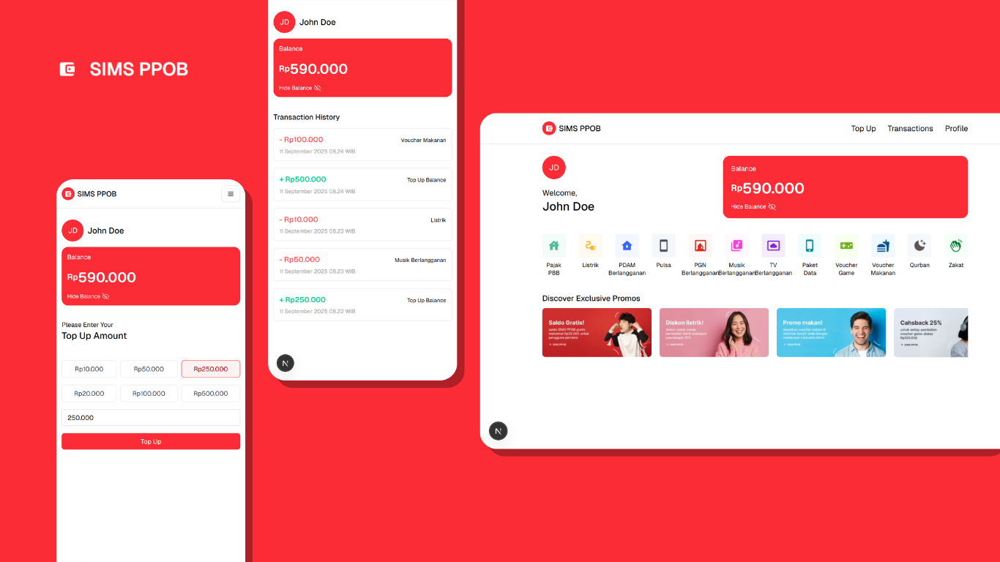

<div align="center">
  <h1>SIMS PPOB</h1>
  <p>Seamless Online Payments and Top-Ups</p>

  <p>
    
    
    
  </p>

  <p align="center">
    
  </p>

  <p>Built with the following tools and technologies:</p>

  <p>
    
    
    
    
    
    
    
    
    
    
    
  </p>
</div>

This project is a modern web application designed to streamline online bill payments and top-up services. Built with Next.js and TypeScript, this application offers a seamless and responsive user experience, with a strong focus on security and ease of use.

## Key Features ✨

- **User Authentication:** Secure registration and login system using token-based authentication.
- **Balance Top-Up:** Users can easily add funds to their account balance with various denominations.
- **Bill Payments:** Pay for a variety of digital services quickly and conveniently.
- **Profile Management:** Users can view and update their profile information, including their name and profile picture.
- **Transaction History:** Access a comprehensive list of all past transactions.
- **Balance Display:** User balance is clearly displayed, with an option to hide or show it for privacy.
- **Responsive Design:** A user-friendly interface that is accessible across various devices, including desktop and mobile.

## Tech Stack 💻

- **Framework:** [Next.js](https://nextjs.org/)
- **Language:** [TypeScript](https://www.typescriptlang.org/)
- **Styling:** [Tailwind CSS](https://tailwindcss.com/)
- **State Management:** [Zustand](https://zustand-demo.pmnd.rs/)
- **Schema Validation:** [Zod](https://zod.dev/)
- **UI Components:** [shadcn/ui](https://ui.shadcn.com/)
- **HTTP Client:** Fetch API

## Getting Started 🚀

To run this project locally, follow these steps:

1.  **Clone the repository:**

    ```bash
    git clone https://github.com/lskeey/sims-ppob.git
    ```

2.  **Install dependencies:**

    ```bash
    npm install
    ```

3.  **Run the development server:**

    ```bash
    npm run dev
    ```

4.  Open [http://localhost:3000](http://localhost:3000) in your browser.

## Project Structure 📂

<pre>
lskeey/sims-ppob/
├── app/                      # Routing, layouts, and pages
│   ├── (protected)/          # Authentication-protected routes
│   ├── auth/                 # Authentication pages (login, register)
│   ├── favicon.ico
│   ├── globals.css
│   ├── layout.tsx
│   └── page.tsx
├── components/               # React components
│   ├── auth/                 # Authentication-related components
│   ├── features/             # Feature-specific components
│   ├── layout/               # Layout components (header, dashboard)
│   ├── ui/                   # General UI components (Button, Card, etc.)
│   └── nav-menu.tsx
├── lib/                      # Utility functions
│   └── utils.ts
├── public/                   # Static assets (images, icons)
├── schemas/                  # Zod validation schemas
│   └── index.ts
├── services/                 # Logic for interacting with the API
│   ├── auth/
│   ├── profile/
│   ├── promo/
│   ├── services/
│   ├── topup/
│   ├── transaction/
│   └── utils/
├── stores/                   # State management with Zustand
├── types/                    # TypeScript type definitions
├── .gitignore
├── middleware.ts             # Middleware for route authentication
├── next.config.ts
├── package.json
├── README.md
└── tsconfig.json
</pre>
